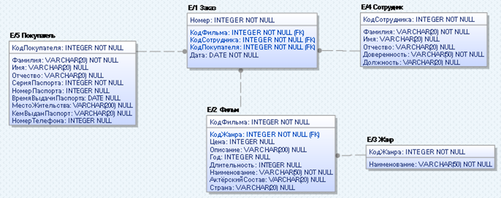

# Онлайн-магазин фильмов

Приложение предназначено для осуществления заказа
фильма определенного жанра конкретным покупателем. 
Заказы регистрирует менеджер.
Можно выбирать менеджера, которым будет зарегистрирован заказ.
Имеются функции добавления и удаления покупателей, фильмов, жанров, заказов. 
Также можно редактировать заказы и фильмы.
Имеется механизм генерации двух видов отчетов:
* отчет о выручке с продажи фильмов конкретных жанров за выбранный период
* отчет о деятельности конкретного сотрудника за выбранный период

ER-диаграмма представлена на рисунке ниже:


## Запуск
### Docker

```
docker-compose up
```

### Обычный

```
npm install
npm run prefill 
npm run start
```

### Технологии

* node.js
* express
* PostgreSQL


